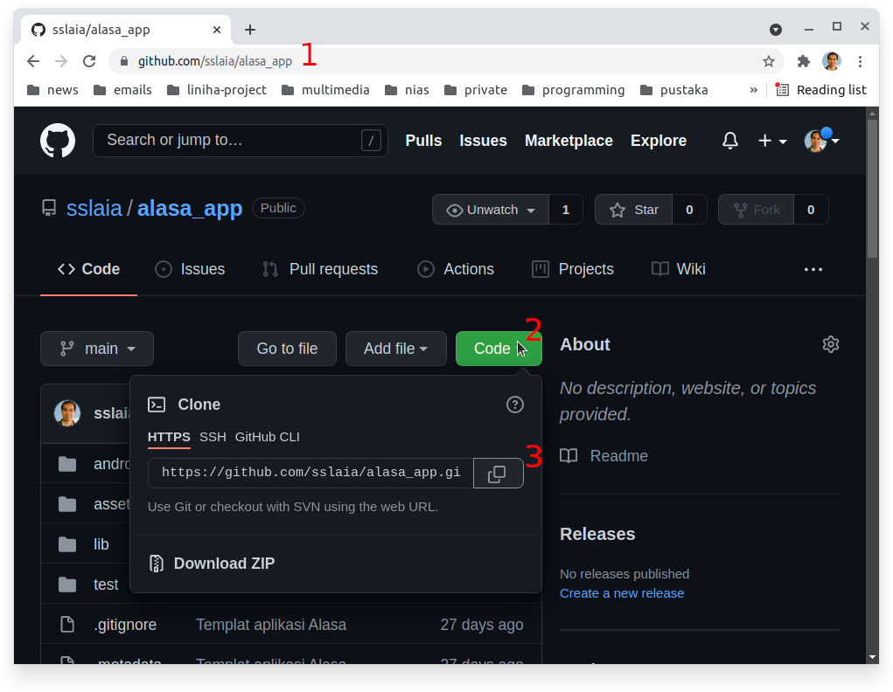
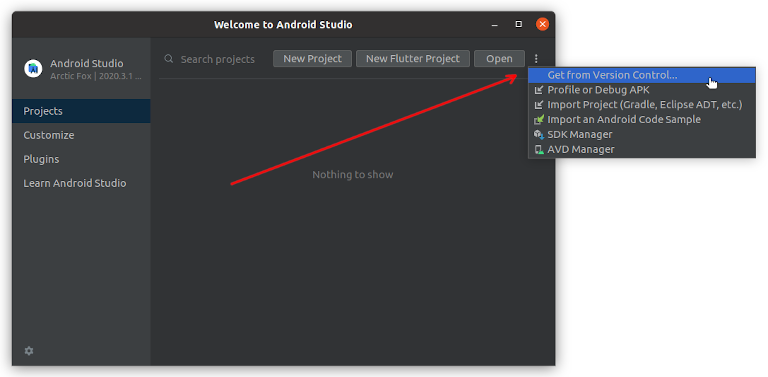
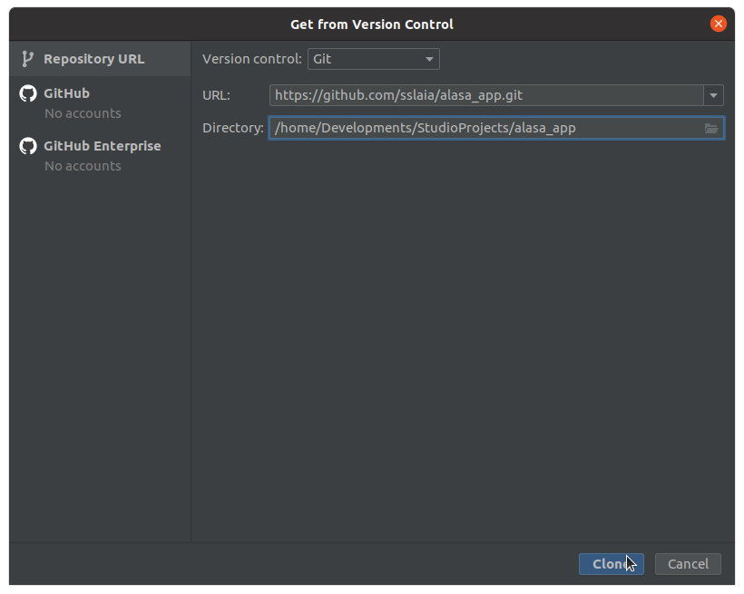

# Cara menciptakan kopi identik satu proyek dari GitHub

**Catatan:** Panduan berikut mengandaikan Git telah terinstalasi di komputer Anda. Bila GitHub tidak terinstal, lihat cara menginstal Git di akhir panduan ini.

## Langkah 1: Kopi alamat proyek di GitHub
1. Pergi ke proyek yang bersangkutan di GitHub. Andaikan misalnya Anda ingin menciptakan kopi identik proyek aplikasi Alasa. Buka `https://github.com/sslaia/alasa_app` di browser (no. 1 di gambar di bawah ini).
2. Klik di tombol hijau `Code` (no. 2)
3. Pastikan yang terpilih adalah HTTPS di jendela kecil yang terbuka.
4. Klik ikon kopi di akhir baris alamat proyek (no. 3).

## Langkah 2: Menciptakan kopi identik di dalam Android Studio

1. Buka AS (Android Studio)
2. Bila Anda memulai dari satu proyek yang telah terbuka, klik **File** > **New** > **Project from Version Control**

3. Bila Anda berada di halaman depan AS (lihat gambar di atas), maka klik tiga tanda titik di barisan tombol sebelah atas, kemudian di jendela kecil yang muncul, pilih **Get from Version Control**
4. Di layar berikut, klik sekali di tempat isian **URL** (lihat gambar berikut), lalu sisipkan (**Ctrl+V**) di dalamnya alamat proyek yang tadi dikopi dari GitHub
5. Klik di tombol **Clone**

**Catatan:** Bila pada salah satu langkah di atas, AS mengeluh bahwa git tidak ada dan mengusulkan untuk menginstal, silakan mengikuti usul tsb. Nanti git akan otomatis diinstal.

## Cara menginstal Git

1. Di dalam browser kunjungi alamat `https://gitforwindows.org`
2. Klik tombol **Download**
3. Di halaman yang baru terbuka, pergi ke bawah di bagian **Assets**
4. Cari versi terakhir dengan angka 64-bit. Misalnya waktu panduan ini ditulis versi yang tersedia adalah **Git-2.33.1-64-bit.exe** Klik di berkas tsb. untuk memulai proses download.
5. Akan terbuka jendela untuk menanyakan di mana berkas tsb. mau disimpan. Pastikan memilih folder **Downloads** sehingga Anda gampang menemukannya kembali nanti.
6. Setelah proses download selesai, pergi ke folder Downloads, lalu klik ganda di atas berkas yang baru kita download tadi.
7. Ikuti saja proses instalasi
8. Selesai
